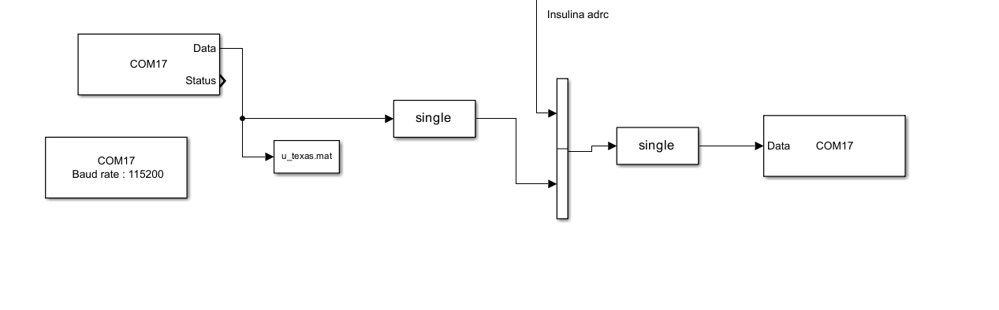

# Protocolos de comunicación

Esta carpeta contiene la documentación de las interfaces de comunicación utilizadas en la plataforma hardware-in-the-loop (HIL) del proyecto GLULOOP-HIL.

## Comunicación serial entre UVA/Padova y LAUNCHXL-F28379D

La comunicación entre el simulador UVA/Padova T1DM y la tarjeta Texas Instruments LAUNCHXL-F28379D se realiza mediante bloques de comunicación serial implementados en MATLAB/Simulink.

La Figura 1 presenta el esquema utilizado para recibir y transmitir las señales entre ambos componentes.

**Figura 1.** Esquema de comunicación serial implementado en Simulink para el intercambio de información entre el simulador y la tarjeta LAUNCHXL-F28379D.

En la configuración presentada se utiliza el puerto COM17, con una velocidad de transmisión de 115200 baudios. Los bloques de conversión de datos permiten trabajar con señales de tipo `single`, mientras que los bloques de recepción y transmisión gestionan el intercambio de información con la tarjeta.

El puerto COM17 corresponde a la configuración del equipo utilizado durante el desarrollo y debe ajustarse según el puerto asignado en cada computador.

## Comunicación con GLULOOP

La comunicación con la aplicación Android GLULOOP se gestiona mediante el programa [`servidor_parametros.py`](../servidor_parametros.py).

Este programa permite intercambiar información con la tarjeta mediante comunicación serial y establecer una conexión WebSocket con la aplicación móvil.

La arquitectura permite visualizar variables del sistema, como la glucosa, la insulina y la insulina activa estimada (IOB), además de intercambiar los parámetros de configuración disponibles.
