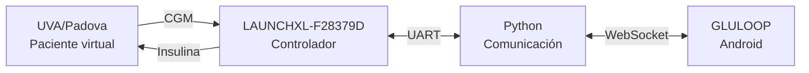

# GLULOOP-HIL

### Plataforma de Simulación Hardware-in-the-Loop para Validación de Estrategias de Control en Páncreas Artificial

<p align="center">
  <strong>Trabajo de Grado · Ingeniería Electrónica</strong><br>
  Universidad Industrial de Santander
</p>

<p align="center">
  
  
  
  
  
</p>

---

## Sobre el proyecto

**GLULOOP-HIL** es una plataforma experimental desarrollada para la implementación y validación de estrategias de control orientadas a sistemas de páncreas artificial mediante pruebas **Hardware-in-the-Loop (HIL)**.

El proyecto utiliza el simulador **UVA/Padova T1DM** para representar pacientes virtuales con Diabetes Mellitus Tipo 1 (DMT1) e implementa una estrategia de **Control por Rechazo Activo de Perturbaciones (ADRC)** para la regulación automática de glucosa.

La plataforma integra simulación en MATLAB/Simulink, ejecución del controlador sobre una **Texas Instruments LAUNCHXL-F28379D**, comunicación en tiempo real y la aplicación móvil **GLULOOP** para supervisión y configuración experimental.

> [!IMPORTANT]
> Este proyecto fue desarrollado exclusivamente con fines académicos y de investigación. No constituye un dispositivo médico ni está destinado al manejo clínico de pacientes.

---

## Arquitectura



El simulador representa la dinámica fisiológica del paciente, mientras que durante las pruebas HIL el algoritmo de control se ejecuta externamente sobre la plataforma microcontrolada.

---

## Estrategia de control

La estrategia implementada integra:

- filtro de Kalman para acondicionamiento de la señal;
- Observador de Estado Extendido (ESO);
- controlador ADRC;
- lógica supervisora;
- estimación de Insulin on Board (IOB);
- módulo de seguridad IOB SAFE.

```text
CGM
 │
 ▼
Kalman
 │
 ▼
ESO
 │
 ▼
ADRC
 │
 ▼
Supervisor + IOB SAFE
 │
 ▼
Insulina
```

---

## Escenarios experimentales

La estrategia se evalúa sobre los **10 pacientes adultos virtuales** disponibles en UVA/Padova mediante dos escenarios de ingesta diaria.

| Escenario | 06:00 | 13:00 | 19:00 | Total |
|:---|---:|---:|---:|---:|
| **100 gCH/día** | 30 gCH | 40 gCH | 30 gCH | 100 gCH |
| **130 gCH/día** | 40 gCH | 50 gCH | 40 gCH | 130 gCH |

Los ensayos tienen una duración simulada de **24 horas**.

La validación HIL se realiza posteriormente sobre pacientes seleccionados utilizando los mismos escenarios experimentales.

---

## Estructura del repositorio

```text
GLULOOP-HIL/
│
├── controller/       # Estrategia de control
├── experiments/      # Escenarios y configuración de experimentos
├── hil/              # Implementación Hardware-in-the-Loop
├── gluloop/          # Aplicación móvil Android
├── analysis/         # Procesamiento, métricas y gráficas
├── results/          # Resultados experimentales
├── appendices/       # Anexos del trabajo de grado
├── docs/             # Documentación técnica
└── README.md
```

Cada sección contiene su propio `README.md` con información específica sobre los archivos y procedimientos correspondientes.

---

## Resultados

Los resultados se organizan en tres etapas:

- **Identificación:** ensayos en lazo abierto y modelos obtenidos para los pacientes virtuales.
- **Simulación:** evaluación de los 10 pacientes bajo los escenarios de 100 y 130 gCH/día.
- **HIL:** validación del controlador ejecutado sobre hardware.

Se analizan variables como glucosa, administración de insulina e IOB, junto con métricas de control glucémico y desempeño del controlador.

Los resultados completos se encuentran en [`results/`](./results/).

---

## GLULOOP

**GLULOOP** es la aplicación Android desarrollada para la supervisión de la plataforma HIL.

Permite visualizar en tiempo real variables como:

- glucosa;
- insulina;
- IOB;
- estado de conexión;
- tiempo de operación.

También permite configurar los parámetros requeridos para los ensayos experimentales.

El proyecto Android se encuentra en [`gluloop/`](./gluloop/).

---

## Tecnologías

- MATLAB / Simulink
- UVA/Padova T1DM Simulator
- Texas Instruments C2000
- LAUNCHXL-F28379D
- Python
- WebSocket
- Android / Kotlin
- GLULOOP

> El simulador UVA/Padova es una herramienta externa y no se distribuye como parte de este repositorio.

---

## Estado

🚧 **Proyecto en desarrollo**

Actualmente se encuentra en proceso de consolidación de resultados, validación HIL y documentación final del trabajo de grado.

---

## Autores

**Leonel Ricardo Araque Carreño**  
**Paula Dayana Torres Mejía**

Ingeniería Electrónica  
Escuela de Ingenierías Eléctrica, Electrónica y de Telecomunicaciones  
Universidad Industrial de Santander  
Bucaramanga, Colombia

### Director

**José Jorge Carreño Zagarra, Ph.D.**

---

## Aviso

Este repositorio corresponde a una plataforma experimental desarrollada con fines académicos y de investigación.

**GLULOOP-HIL no es un dispositivo médico y no debe utilizarse para administrar insulina ni para tomar decisiones relacionadas con el tratamiento de personas con diabetes.**
