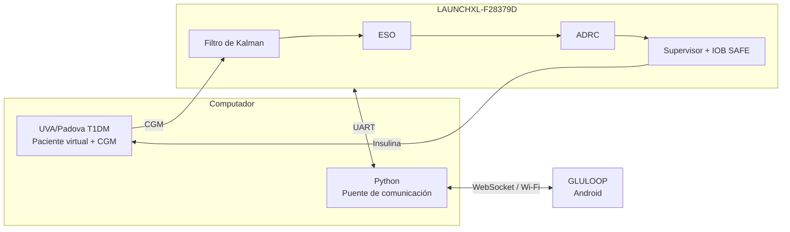

# GLULOOP-HIL

### Plataforma de simulación Hardware-in-the-Loop para validación de estrategias de control en páncreas artificial

<p align="center">
  <strong>Trabajo de grado · Ingeniería Electrónica</strong><br>
  Universidad Industrial de Santander · Bucaramanga, 2026
</p>

<p align="center">
  
  
  
  
  
</p>

| | |
|---|---|
| **Autores** | Leonel Ricardo Araque Carreño · Paula Dayana Torres Mejía |
| **Director** | José Jorge Carreño Zagarra, Ph.D. |
| **Institución** | Universidad Industrial de Santander |
| **Programa** | Ingeniería Electrónica |
| **Documento de tesis** | `PENDIENTE: enlace al repositorio institucional` |

> [!IMPORTANT]
> Este proyecto fue desarrollado exclusivamente con fines académicos y de investigación. No constituye un dispositivo médico y no debe utilizarse para administrar insulina ni para tomar decisiones relacionadas con el tratamiento de personas con diabetes.

---

## Tabla de contenido

1. [Sobre el proyecto](#sobre-el-proyecto)
2. [Arquitectura](#arquitectura)
3. [Estrategia de control](#estrategia-de-control)
4. [Escenarios experimentales](#escenarios-experimentales)
5. [GLULOOP](#gluloop)
6. [Resultados](#resultados)
7. [Estructura del repositorio](#estructura-del-repositorio)
8. [Tecnologías y reproducibilidad](#tecnologías-y-reproducibilidad)
9. [Ejecución rápida](#ejecución-rápida)
10. [Limitaciones](#limitaciones)
11. [Estado del proyecto](#estado-del-proyecto)
12. [Cómo citar](#cómo-citar)
13. [Licencia y uso](#licencia-y-uso)

---

## Sobre el proyecto

**GLULOOP-HIL** es una plataforma experimental desarrollada para implementar y validar estrategias de control orientadas a sistemas de páncreas artificial mediante pruebas **Hardware-in-the-Loop (HIL)**.

El proyecto utiliza el simulador **UVA/Padova T1DM** para representar pacientes virtuales con Diabetes Mellitus Tipo 1 (DMT1) e implementa una estrategia de **Control por Rechazo Activo de Perturbaciones (ADRC)** para la regulación automática de glucosa.

La plataforma integra:

- simulación fisiológica en MATLAB/Simulink;
- acondicionamiento de la señal de glucosa;
- estimación mediante un Observador de Estado Extendido (ESO);
- control ADRC;
- mecanismos de supervisión y seguridad;
- ejecución del algoritmo sobre hardware;
- comunicación en tiempo real;
- aplicación móvil GLULOOP.

Durante las pruebas HIL, el controlador se ejecuta externamente sobre una **Texas Instruments LAUNCHXL-F28379D**, mientras que GLULOOP permite supervisar y configurar los ensayos.

El desarrollo matemático, el procedimiento de identificación, la metodología experimental y el análisis detallado se encuentran en el documento de tesis y en [`docs/`](docs/).

---

## Arquitectura

La plataforma HIL integra el simulador fisiológico, el controlador embebido y la interfaz móvil.



El simulador representa la dinámica fisiológica del paciente y proporciona la medición de glucosa. La tarjeta ejecuta los algoritmos de procesamiento, estimación, control y seguridad.

Un canal adicional permite transmitir información entre el hardware y GLULOOP mediante una interfaz de comunicación basada en Python y WebSocket.

La descripción detallada de la arquitectura se encuentra en [`docs/`](docs/) y [`hil/`](hil/).

---

## Estrategia de control

La estrategia implementada está compuesta por:

- **Filtro de Kalman:** acondicionamiento de la señal procedente del CGM.
- **ESO:** observador de estado extendido de tercer orden.
- **ADRC:** cálculo de la acción de control para la regulación de glucosa.
- **Supervisor:** modificación de la acción de control según el estado estimado del sistema.
- **Estimador IOB:** estimación de la insulina activa.
- **IOB SAFE:** mecanismo de seguridad basado en la cantidad estimada de insulina activa.
- **Saturaciones:** limitación de la tasa de administración de insulina.

El flujo general puede representarse como:

```text
CGM
 │
 ▼
Filtro de Kalman
 │
 ▼
ESO
 │
 ▼
ADRC
 │
 ▼
Supervisor
 │
 ▼
IOB SAFE
 │
 ▼
Insulina
 │
 ▼
Paciente virtual
```

Para apoyar el diseño del controlador, la dinámica glucosa-insulina de cada paciente fue aproximada mediante modelos **SOPTD (Second-Order Plus Time Delay)** obtenidos a partir de ensayos en lazo abierto.

La implementación del controlador se encuentra en [`controller/`](controller/).

---

## Escenarios experimentales

La estrategia se evalúa sobre los **10 pacientes adultos virtuales** disponibles en UVA/Padova.

Se utilizan dos escenarios diarios de ingesta de carbohidratos:

| Escenario | 06:00 | 13:00 | 19:00 | Total |
|:---|---:|---:|---:|---:|
| **100 gCH/día** | 30 gCH | 40 gCH | 30 gCH | 100 gCH |
| **130 gCH/día** | 40 gCH | 50 gCH | 40 gCH | 130 gCH |

Cada ensayo tiene una duración simulada de **24 horas**.

Los mismos escenarios son utilizados posteriormente durante la validación Hardware-in-the-Loop para los pacientes seleccionados.

Los archivos asociados a la configuración de los experimentos se encuentran en [`experiments/`](experiments/).

---

## GLULOOP

**GLULOOP** es la aplicación Android desarrollada para la supervisión y configuración de la plataforma HIL.

La aplicación permite visualizar información recibida durante los ensayos, incluyendo:

- glucosa;
- administración de insulina;
- Insulin on Board (IOB);
- estado de conexión;
- tiempo de operación.

También permite configurar parámetros requeridos antes de iniciar una prueba y visualizar información asociada al ensayo.

<!-- PENDIENTE: agregar capturas finales de GLULOOP.

<p align="center">
  
  
  
</p>

-->

El código fuente de la aplicación se encuentra en [`gluloop/`](gluloop/).

---

## Resultados

La validación experimental se encuentra organizada en tres etapas principales.

### Identificación

Se realizan ensayos en lazo abierto sobre los pacientes virtuales para obtener modelos simplificados de la dinámica glucosa-insulina.

Los resultados correspondientes se encuentran en:

[`results/identification/`](results/identification/)

### Simulación

Los 10 pacientes adultos son evaluados bajo los escenarios de:

- 100 gCH/día;
- 130 gCH/día.

Para cada paciente se almacenan los datos, gráficas y métricas correspondientes.

Se evalúan indicadores de control glucémico como:

- **TIR:** tiempo entre 70 y 180 mg/dL;
- **TAR:** tiempo por encima de 180 mg/dL;
- **TBR:** tiempo por debajo de 70 mg/dL;
- glucosa mínima;
- glucosa máxima.

También se calculan métricas asociadas al desempeño del controlador:

- MSE;
- RMSE;
- IAE;
- ISE;
- ITAE;
- esfuerzo de control.

Los resultados completos se encuentran en:

[`results/simulation/`](results/simulation/)

### Hardware-in-the-Loop

La estrategia es posteriormente validada mediante la ejecución del controlador sobre la LAUNCHXL-F28379D.

Los resultados incluyen registros de glucosa, administración de insulina y variables asociadas al funcionamiento de la plataforma y de GLULOOP.

Los resultados se encuentran en:

[`results/hil/`](results/hil/)

<!--
PENDIENTE:
Agregar aquí una tabla muy pequeña con los resultados principales
cuando estén consolidados todos los ensayos.
-->

---

## Estructura del repositorio

```text
GLULOOP-HIL/
│
├── controller/      # Estrategia de control
├── experiments/     # Configuración de los experimentos
├── hil/             # Implementación Hardware-in-the-Loop
├── gluloop/         # Aplicación móvil Android
├── analysis/        # Procesamiento, métricas y gráficas
├── results/         # Resultados experimentales
├── appendices/      # Anexos del trabajo de grado
├── docs/            # Documentación técnica
└── README.md
```

### Organización de resultados

```text
results/
│
├── identification/
│   ├── patient_01/
│   ├── ...
│   ├── patient_10/
│   └── summary/
│
├── simulation/
│   ├── 100gCH/
│   │   ├── patient_01/
│   │   ├── ...
│   │   └── patient_10/
│   │
│   ├── 130gCH/
│   │   ├── patient_01/
│   │   ├── ...
│   │   └── patient_10/
│   │
│   └── summary/
│
└── hil/
    ├── 100gCH/
    ├── 130gCH/
    └── summary/
```

Cada carpeta principal contiene su propio `README.md` con información específica sobre sus archivos y procedimientos.

---

## Tecnologías y reproducibilidad

### Software

| Herramienta | Versión |
|---|---|
| MATLAB / Simulink | **PENDIENTE** |
| System Identification Toolbox | **PENDIENTE** |
| Soporte de Simulink para TI C2000 | **PENDIENTE** |
| UVA/Padova T1DM Simulator | **PENDIENTE** |
| Python | **PENDIENTE** |
| Android Studio | **PENDIENTE** |
| Kotlin / Android SDK | **PENDIENTE** |

### Hardware

- Texas Instruments **LAUNCHXL-F28379D**;
- microcontrolador **TMS320F28379D**;
- computador para MATLAB/Simulink y UVA/Padova;
- dispositivo Android;
- interfaces de comunicación utilizadas en la plataforma.

### Correspondencia entre código y resultados

| Etapa | Implementación / análisis | Resultados |
|---|---|---|
| Identificación SOPTD | [`experiments/`](experiments/) | [`results/identification/`](results/identification/) |
| Simulación | [`controller/`](controller/) | [`results/simulation/`](results/simulation/) |
| Análisis de métricas | [`analysis/`](analysis/) | [`results/simulation/`](results/simulation/) |
| Validación HIL | [`hil/`](hil/) | [`results/hil/`](results/hil/) |
| Aplicación móvil | [`gluloop/`](gluloop/) | [`results/hil/`](results/hil/) |

### UVA/Padova

El **UVA/Padova T1DM Simulator** es una herramienta externa utilizada como representación fisiológica de los pacientes virtuales.

El simulador **no se distribuye como parte de este repositorio**.

Para reproducir completamente los experimentos es necesario disponer de acceso legítimo al simulador y cumplir sus respectivas condiciones de uso y distribución.

---

## Ejecución rápida

> [!NOTE]
> Esta sección será verificada y completada cuando todos los componentes del repositorio hayan sido consolidados.

### 1. Obtener el repositorio

```bash
git clone PENDIENTE_URL_REPOSITORIO
cd GLULOOP-HIL
```

### 2. Simulación

1. Disponer de una instalación autorizada de UVA/Padova.
2. Consultar la implementación disponible en [`controller/`](controller/).
3. Seleccionar el paciente y escenario experimental correspondiente.
4. Ejecutar el ensayo.
5. Almacenar los resultados para su procesamiento.

### 3. Hardware-in-the-Loop

1. Conectar la LAUNCHXL-F28379D.
2. Cargar la implementación correspondiente sobre la tarjeta.
3. Establecer la comunicación con el entorno de simulación.
4. Ejecutar el ensayo HIL.

La documentación específica se encuentra en [`hil/`](hil/).

### 4. GLULOOP

1. Ejecutar el puente de comunicación correspondiente.
2. Conectar el dispositivo Android a la red utilizada durante el ensayo.
3. Iniciar GLULOOP.
4. Verificar la recepción de telemetría.
5. Configurar los parámetros requeridos antes de comenzar la prueba.

### 5. Análisis

Los scripts empleados para procesar los resultados y generar las métricas y figuras se encuentran en:

[`analysis/`](analysis/)

<!--
PENDIENTE:
Reemplazar esta sección por los comandos y pasos exactos
una vez organizada la versión final de cada componente.
-->

---

## Limitaciones

- La evaluación se realiza *in silico* utilizando pacientes virtuales adultos.
- La validación HIL se realiza sobre un subconjunto de los pacientes evaluados mediante simulación.
- Los parámetros y límites experimentales utilizados en la estrategia de control no deben interpretarse como recomendaciones clínicas.
- La plataforma constituye un entorno experimental de investigación y no un sistema destinado al tratamiento de pacientes reales.

La discusión detallada de las limitaciones se encuentra en el documento de tesis.

---

## Estado del proyecto

🚧 **En desarrollo**

El proyecto se encuentra actualmente en proceso de consolidación y documentación final.

Entre las actividades pendientes se encuentran:

- organización definitiva de los resultados;
- finalización de las pruebas HIL;
- incorporación de la estrategia de control de referencia;
- comparación de estrategias de control;
- consolidación de anexos;
- documentación final para reproducibilidad.

---

## Cómo citar

Si utiliza este repositorio o los resultados del trabajo, cite:

```bibtex
@thesis{araque_torres_2026_gluloophil,
  author  = {Araque Carreño, Leonel Ricardo and Torres Mejía, Paula Dayana},
  title   = {Plataforma de simulación Hardware-in-the-Loop para validación de estrategias de control en páncreas artificial},
  school  = {Universidad Industrial de Santander},
  address = {Bucaramanga, Colombia},
  year    = {2026},
  type    = {Trabajo de grado},
  note    = {Director: José Jorge Carreño Zagarra}
}
```

<!--
PENDIENTE:
Verificar los datos bibliográficos definitivos después de la
publicación del trabajo en el repositorio institucional de la UIS.
-->

---

## Licencia y uso

**PENDIENTE:** definir la licencia aplicable al código, documentación y resultados desarrollados por los autores.

Los componentes pertenecientes a terceros conservan sus respectivas condiciones de uso y distribución.

En particular, **UVA/Padova T1DM Simulator no forma parte de este repositorio** y debe obtenerse a través de los canales autorizados correspondientes.

---

## Aviso

Este repositorio corresponde a una plataforma experimental desarrollada con fines académicos y de investigación.

**GLULOOP-HIL no es un dispositivo médico, no ha sido diseñado para uso clínico y no debe utilizarse para administrar insulina ni para tomar decisiones relacionadas con el tratamiento de personas con diabetes.**
