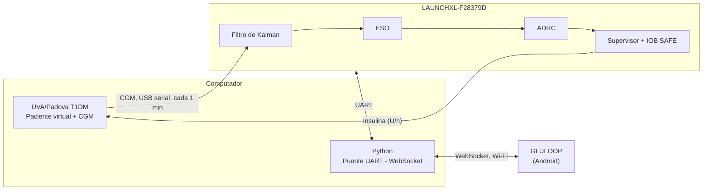

# GLULOOP-HIL

### Plataforma de simulación Hardware-in-the-Loop para validación de estrategias de control en páncreas artificial

<p align="center">
  <strong>Trabajo de grado · Ingeniería Electrónica</strong><br>
  Universidad Industrial de Santander · Bucaramanga, 2026
</p>

| | |
|---|---|
| **Autores** | Leonel Ricardo Araque Carreño, Paula Dayana Torres Mejía |
| **Director** | José Jorge Carreño Zagarra, Ph.D. |
| **Documento de tesis** | [Enlace al PDF o al repositorio institucional](#) |

> [!IMPORTANT]
> Este proyecto fue desarrollado exclusivamente con fines académicos y de investigación. No constituye un dispositivo médico y no debe utilizarse para administrar insulina ni para tomar decisiones relacionadas con el tratamiento de personas con diabetes.

---

## Contenido

1. [Sobre el proyecto](#sobre-el-proyecto)
2. [Arquitectura](#arquitectura)
3. [Estrategia de control](#estrategia-de-control)
4. [Escenarios experimentales](#escenarios-experimentales)
5. [Resultados](#resultados)
6. [GLULOOP](#gluloop)
7. [Estructura del repositorio](#estructura-del-repositorio)
8. [Tecnologías y reproducibilidad](#tecnologías-y-reproducibilidad)
9. [Ejecución rápida](#ejecución-rápida)
10. [Datos y licencias](#datos-y-licencias)
11. [Limitaciones](#limitaciones)
12. [Estado del proyecto](#estado-del-proyecto)
13. [Cómo citar](#cómo-citar)

---

## Sobre el proyecto

**GLULOOP-HIL** es una plataforma experimental para implementar y validar estrategias de control orientadas a sistemas de páncreas artificial mediante pruebas **Hardware-in-the-Loop (HIL)**.

Se utiliza el simulador **UVA/Padova T1DM** para representar pacientes virtuales con diabetes mellitus tipo 1 (DMT1) y se implementa una estrategia de **Control por Rechazo Activo de Perturbaciones (ADRC)** para la regulación automática de glucosa. El controlador se ejecuta de forma externa en una **Texas Instruments LAUNCHXL-F28379D**, y la aplicación móvil **GLULOOP** permite supervisar y configurar los ensayos.

El desarrollo matemático, la identificación de los pacientes y el análisis completo se encuentran en el documento de tesis y en [`docs/`](docs/).

## Arquitectura



El simulador representa la dinámica fisiológica del paciente y genera la medición del CGM. El algoritmo de control se ejecuta en la tarjeta. El intercambio ocurre cada minuto, por lo que un ensayo de 24 h simuladas requiere 24 h de ejecución real. Más detalle en [`docs/architecture/`](docs/architecture/) y [`hil/`](hil/).

## Estrategia de control

- Modelo simplificado de segundo orden con tiempo muerto (SOPTD), identificado por paciente.
- Filtro de Kalman para acondicionar la señal del CGM.
- Observador de estado extendido (ESO) de tercer orden.
- Controlador ADRC con ley de control PD.
- Caja supervisora y estimación de insulina activa (*Insulin on Board*, IOB).
- Módulo de seguridad IOB SAFE y saturación de la tasa de infusión.

## Escenarios experimentales

La estrategia se evalúa sobre los **10 pacientes adultos virtuales** de UVA/Padova con dos escenarios de ingesta diaria.

| Escenario | 06:00 | 13:00 | 19:00 | Total |
|:---|---:|---:|---:|---:|
| **100 gCH/día** | 30 gCH | 40 gCH | 30 gCH | 100 gCH |
| **130 gCH/día** | 40 gCH | 50 gCH | 40 gCH | 130 gCH |

Los ensayos tienen una duración simulada de 24 h. La validación HIL se realiza sobre tres pacientes (#3, #8 y #10) con los mismos escenarios.

## Resultados

Los resultados se organizan en tres etapas:

- **Identificación:** ensayos en lazo abierto y modelos obtenidos para los pacientes virtuales.
- **Simulación:** evaluación de los 10 pacientes en los escenarios de 100 y 130 gCH/día.
- **HIL:** validación del controlador ejecutado sobre hardware.

Resumen del control glucémico en simulación, caso menos favorable entre los 10 pacientes:

| Indicador | Objetivo (consenso CGM) | 100 gCH/día | 130 gCH/día |
|---|---|---|---|
| Tiempo en rango (70-180 mg/dL) | > 16,8 h (70 %) | 21,2 h | 20,1 h |
| Tiempo > 180 mg/dL | < 6,0 h (25 %) | 2,8 h | 3,9 h |
| Tiempo < 70 mg/dL | < 1,0 h (4 %) | 0 h | 0 h |

En ambos escenarios, incluso en el peor caso (Adulto #7), los indicadores se mantienen dentro de los objetivos internacionales y no se registran valores por debajo de 70 mg/dL en simulación. Además de las métricas glucémicas (TIR, TAR, TBR), se calculan métricas de desempeño del controlador (RMSE, IAE, ISE, ITAE) y del esfuerzo de control.

Los resultados completos se encuentran en [`results/`](results/) y [`appendices/`](appendices/).

## GLULOOP

**GLULOOP** es la aplicación Android desarrollada para la supervisión de la plataforma HIL. Permite visualizar en tiempo real la glucosa, la insulina, el IOB y el estado de conexión, y configurar antes de cada ensayo el parámetro `b0`, la referencia de glucosa y la glucosa basal. También presenta el análisis de los ensayos de 24 h.

<!-- Capturas: gluloop/screenshots/ -->
<!--  -->

El proyecto Android se encuentra en [`gluloop/`](gluloop/).

## Estructura del repositorio

```text
GLULOOP-HIL/
├── controller/      Controlador ADRC (modelos Simulink)
├── experiments/     Escenarios de alimentación y pruebas en lazo abierto
├── hil/             Firmware de la tarjeta y comunicación (Python, protocolos)
├── gluloop/         Aplicación móvil Android y capturas
├── analysis/        Procesamiento, métricas y gráficas
├── results/         Resultados de identificación, simulación y HIL
├── appendices/      Anexos del trabajo de grado
└── docs/            Arquitectura, diagramas, hardware y referencias
```

Cada carpeta contiene su propio `README.md` con los archivos y procedimientos correspondientes.

## Tecnologías y reproducibilidad

| Elemento | Versión |
|---|---|
| MATLAB / Simulink | _indicar versión_ |
| System Identification Toolbox | _indicar versión_ |
| Soporte de Simulink para TI C2000 | _indicar versión_ |
| UVA/Padova T1DM Simulator | _indicar versión_ (herramienta externa, no incluida) |
| Hardware | Texas Instruments LAUNCHXL-F28379D (TMS320F28379D), cable USB |
| Python | _indicar versión_; `pyserial`, `websockets` |
| Android | Kotlin; _indicar SDK mínimo_ |

Correspondencia entre resultados de la tesis y su origen:

| Resultado | Código | Datos |
|---|---|---|
| Identificación SOPTD | [`experiments/open-loop/`](experiments/open-loop/) | [`results/identification/`](results/identification/) |
| Métricas glucémicas y del controlador | [`analysis/metrics/`](analysis/metrics/) | [`results/simulation/`](results/simulation/) |
| Ensayos HIL | [`hil/`](hil/) | [`results/hil/`](results/hil/) |

## Ejecución rápida

```bash
git clone https://github.com/<usuario>/GLULOOP-HIL.git
cd GLULOOP-HIL
```

1. **Simulación:** abrir el modelo de [`controller/simulink/`](controller/simulink/) en el entorno UVA/Padova, elegir paciente y escenario ([`experiments/scenarios/`](experiments/scenarios/)) y ejecutar 24 h.
2. **HIL:** cargar el firmware de [`hil/embedded/`](hil/embedded/) en la tarjeta, conectarla por USB y ejecutar el modelo HIL en Simulink (serial a 115200 baudios).
3. **Supervisión:** ejecutar el programa de [`hil/communication/python/`](hil/communication/python/) e iniciar GLULOOP en la misma red Wi-Fi. Los parámetros se envían antes del ensayo y permanecen fijos durante la prueba.
4. **Análisis:** ejecutar los scripts de [`analysis/`](analysis/).

## Datos y licencias

- **Código propio** (controlador, firmware, comunicación, app y análisis): _indicar licencia_.
- **Documentación y resultados:** _indicar licencia_.
- **UVA/Padova T1DM:** herramienta externa con licencia propia. No se distribuye en este repositorio.

## Limitaciones

- La validación es *in silico*, con pacientes virtuales adultos.
- `b0` se ajustó manualmente por paciente; las ganancias del PD se sintonizaron con el Adulto #2 y se mantuvieron fijas.
- Los umbrales de IOB y el límite de 8 U/h se determinaron experimentalmente y no son límites clínicos.
- La validación HIL abarca tres pacientes y se ejecuta en tiempo real.

La discusión completa se encuentra en el documento de tesis.

## Estado del proyecto

En proceso de consolidación de resultados, validación HIL y documentación final del trabajo de grado.

## Cómo citar

```bibtex
@thesis{araque_torres_2026_gluloophil,
  author  = {Araque Carre{\~n}o, Leonel Ricardo and Torres Mej{\'i}a, Paula Dayana},
  title   = {Plataforma de simulaci{\'o}n Hardware-in-the-Loop para validaci{\'o}n
             de estrategias de control en p{\'a}ncreas artificial},
  school  = {Universidad Industrial de Santander},
  address = {Bucaramanga, Colombia},
  year    = {2026},
  type    = {Trabajo de grado},
  note    = {Director: Jos{\'e} Jorge Carre{\~n}o Zagarra}
}
```

Bibliografía completa en [`docs/REFERENCES.md`](docs/REFERENCES.md).
