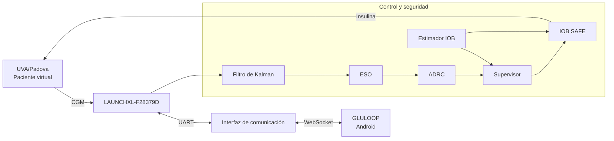

# GLULOOP-HIL

### Plataforma de Simulación Hardware-in-the-Loop para Validación de Estrategias de Control en Páncreas Artificial

<p align="center">
  <strong>Trabajo de Grado · Ingeniería Electrónica</strong><br>
  Universidad Industrial de Santander
</p>

<p align="center">
  
  
  
  
  
</p>

---

## Descripción

**GLULOOP-HIL** es una plataforma experimental desarrollada para la implementación y validación de estrategias de control orientadas a sistemas de páncreas artificial mediante pruebas **Hardware-in-the-Loop (HIL)**.

El proyecto se enfoca en la regulación automática de glucosa en pacientes virtuales con **Diabetes Mellitus Tipo 1 (DMT1)** y utiliza el simulador **UVA/Padova T1DM** como representación computacional de la dinámica fisiológica del paciente.

La estrategia implementada se basa en un **Control por Rechazo Activo de Perturbaciones (ADRC)** y utiliza un **Observador de Estado Extendido (ESO)** para estimar tanto los estados relevantes del sistema como las perturbaciones que afectan la dinámica glucosa-insulina.

La plataforma integra simulación, control embebido, mecanismos de seguridad, comunicación en tiempo real y una aplicación móvil denominada **GLULOOP** para supervisión y configuración experimental.

> [!IMPORTANT]
> Este proyecto fue desarrollado exclusivamente con fines académicos y de investigación. No constituye un dispositivo médico y no debe utilizarse para tomar decisiones clínicas ni para administrar insulina a pacientes reales.

---

## Objetivo del proyecto

Desarrollar una plataforma de simulación Hardware-in-the-Loop que permita implementar y validar estrategias de control para páncreas artificial, evaluando su desempeño ante variaciones fisiológicas y perturbaciones asociadas a la ingesta de carbohidratos.

La plataforma permite estudiar el comportamiento del sistema tanto mediante simulaciones completamente virtuales como mediante la ejecución del algoritmo de control sobre hardware externo.

---

## Arquitectura del sistema

La plataforma está compuesta por cuatro elementos principales:

1. **UVA/Padova T1DM Simulator:** representa virtualmente la dinámica fisiológica del paciente con DMT1.
2. **Controlador ADRC:** procesa la información de glucosa y determina la acción de control requerida.
3. **Plataforma HIL:** ejecuta físicamente el algoritmo de control utilizando una tarjeta Texas Instruments LAUNCHXL-F28379D.
4. **GLULOOP:** aplicación móvil destinada a la supervisión y configuración de los ensayos.



Durante las pruebas HIL, el simulador permanece ejecutándose en el computador mientras que el algoritmo de control es ejecutado externamente sobre la plataforma microcontrolada.

---

## Estrategia de control

La estrategia desarrollada combina diferentes componentes para realizar la regulación automática de glucosa:

```text
CGM
 │
 ▼
Filtro de Kalman
 │
 ▼
Observador de Estado Extendido (ESO)
 │
 ▼
Controlador ADRC
 │
 ▼
Supervisor
 │
 ▼
IOB SAFE
 │
 ▼
Insulina total
 │
 ▼
Paciente virtual
```

### ADRC

El controlador utiliza las estimaciones proporcionadas por el ESO para calcular una acción de control basada en el error de seguimiento y compensar la perturbación total estimada.

### ESO

El Observador de Estado Extendido estima:

- la desviación de glucosa;
- su dinámica temporal;
- la perturbación total que afecta al sistema.

### Mecanismos de seguridad

La estrategia incorpora mecanismos adicionales destinados a limitar la administración de insulina:

- saturación de la acción de control;
- lógica supervisora;
- estimación de **Insulin on Board (IOB)**;
- módulo **IOB SAFE**.

---

## Identificación del sistema

La dinámica glucosa-insulina fue caracterizada mediante experimentos en lazo abierto sobre los pacientes adultos virtuales disponibles en UVA/Padova.

Para cada paciente se obtuvo una representación simplificada mediante un modelo **SOPTD (Second-Order Plus Time Delay)**:

$$
G(s)=
\frac{K e^{-\theta s}}
{(T_1s+1)(T_2s+1)}
$$

donde:

- $K$ corresponde a la ganancia estática;
- $T_1$ y $T_2$ representan las constantes de tiempo;
- $\theta$ corresponde al tiempo muerto.

Estos modelos constituyen representaciones aproximadas de la dinámica observada y se utilizan como apoyo para la parametrización del controlador.

---

## Escenarios de evaluación

La estrategia se evalúa sobre los **10 pacientes adultos virtuales** de UVA/Padova bajo dos escenarios de ingesta diaria de carbohidratos.

| Escenario | 06:00 | 13:00 | 19:00 | Total diario |
|:---|---:|---:|---:|---:|
| **100 gCH/día** | 30 gCH | 40 gCH | 30 gCH | 100 gCH |
| **130 gCH/día** | 40 gCH | 50 gCH | 40 gCH | 130 gCH |

Cada ensayo tiene una duración simulada de **24 horas**.

Los mismos escenarios son utilizados posteriormente durante la validación Hardware-in-the-Loop para los pacientes seleccionados.

---

## Hardware-in-the-Loop

La etapa HIL permite evaluar el comportamiento del controlador cuando el algoritmo deja de ejecutarse exclusivamente dentro del entorno de simulación y pasa a ejecutarse sobre hardware físico.

### Hardware principal

**Texas Instruments LAUNCHXL-F28379D**

La tarjeta incorpora el microcontrolador **TMS320F28379D** de la familia C2000.

En la implementación HIL se ejecutan sobre el hardware los componentes asociados al procesamiento de la señal, estimación, control y seguridad.

### Flujo general

```text
┌──────────────────────────┐
│        Computador        │
│                          │
│  MATLAB / Simulink       │
│  UVA/Padova              │
└────────────┬─────────────┘
             │
         CGM │ ▲ Insulina
             ▼ │
┌──────────────────────────┐
│    LAUNCHXL-F28379D      │
│                          │
│  Kalman → ESO → ADRC     │
│       Supervisor         │
│       IOB SAFE           │
└────────────┬─────────────┘
             │
          Telemetría
             │
             ▼
┌──────────────────────────┐
│         GLULOOP          │
│                          │
│ Glucosa · Insulina · IOB │
└──────────────────────────┘
```

---

## GLULOOP

**GLULOOP** es la aplicación móvil desarrollada como interfaz de supervisión de la plataforma experimental.

La aplicación permite visualizar información proveniente de los ensayos HIL, incluyendo variables como:

- glucosa;
- administración de insulina;
- Insulin on Board (IOB);
- estado de conexión;
- tiempo de operación.

También proporciona una interfaz para la configuración de parámetros requeridos durante las pruebas.

La aplicación se encuentra desarrollada para Android y su código fuente se almacena en [`gluloop/`](./gluloop/).

---

## Métricas de evaluación

El desempeño de la estrategia se analiza desde dos perspectivas.

### Control glucémico

Se consideran indicadores asociados al comportamiento de la glucosa:

| Métrica | Definición |
|:---|:---|
| **TIR** | Tiempo dentro de 70–180 mg/dL |
| **TAR** | Tiempo por encima de 180 mg/dL |
| **TBR** | Tiempo por debajo de 70 mg/dL |
| **Glucosa mínima** | Menor concentración registrada |
| **Glucosa máxima** | Mayor concentración registrada |

### Desempeño del controlador

También se calculan métricas basadas en el error de seguimiento:

- **MSE** — Mean Squared Error;
- **RMSE** — Root Mean Squared Error;
- **IAE** — Integral Absolute Error;
- **ISE** — Integral Squared Error;
- **ITAE** — Integral Time-weighted Absolute Error.

Estas métricas permiten caracterizar cuantitativamente el comportamiento obtenido para los diferentes pacientes y escenarios experimentales.

---

## Estructura del repositorio

```text
GLULOOP-HIL/
│
├── controller/       # Estrategia de control
├── experiments/      # Configuración de escenarios experimentales
├── hil/              # Implementación Hardware-in-the-Loop
├── gluloop/          # Aplicación móvil Android
├── analysis/         # Scripts de análisis, métricas y gráficas
├── results/          # Resultados de simulación, identificación y HIL
├── appendices/       # Anexos del trabajo de grado
├── docs/             # Documentación técnica
└── README.md
```

### `controller/`

Contiene la implementación independiente de la estrategia de control desarrollada en Simulink.

### `experiments/`

Contiene la configuración y los códigos asociados a los escenarios experimentales utilizados durante las pruebas.

### `hil/`

Contiene los elementos relacionados con la implementación sobre hardware y los mecanismos de comunicación utilizados durante las pruebas HIL.

### `gluloop/`

Contiene el proyecto Android correspondiente a la aplicación móvil GLULOOP.

### `analysis/`

Contiene los scripts utilizados para procesar los datos experimentales, calcular métricas y generar las figuras.

### `results/`

Contiene los resultados obtenidos durante:

- identificación en lazo abierto;
- simulación de los diez pacientes;
- escenarios de 100 y 130 gCH/día;
- validación Hardware-in-the-Loop.

### `appendices/`

Contiene los anexos preparados como material complementario del trabajo de grado.

### `docs/`

Contiene documentación técnica, diagramas de arquitectura, conexiones de hardware y referencias del proyecto.

---

## Organización de resultados

Los resultados de simulación se organizan por escenario y paciente:

```text
results/
├── identification/
│   ├── patient_01/
│   ├── ...
│   └── patient_10/
│
├── simulation/
│   ├── 100gCH/
│   │   ├── patient_01/
│   │   ├── patient_02/
│   │   ├── ...
│   │   └── patient_10/
│   │
│   ├── 130gCH/
│   │   ├── patient_01/
│   │   ├── patient_02/
│   │   ├── ...
│   │   └── patient_10/
│   │
│   └── summary/
│
└── hil/
    ├── 100gCH/
    ├── 130gCH/
    └── summary/
```

Cada experimento puede contener:

```text
data/       Datos obtenidos durante la ejecución
figures/    Gráficas generadas
metrics/    Métricas calculadas
```

Los resultados conjuntos de los pacientes se almacenan en `summary/`.

---

## Requisitos

La reproducción completa de la plataforma requiere herramientas de software y hardware externas.

### Software

- MATLAB;
- Simulink;
- UVA/Padova T1DM Simulator;
- herramientas de soporte para Texas Instruments C2000;
- Python 3;
- Android Studio.

> Las versiones exactas utilizadas durante el desarrollo serán documentadas una vez consolidada la configuración final del proyecto.

### Hardware

- Texas Instruments LAUNCHXL-F28379D;
- computador para la ejecución de MATLAB/Simulink y UVA/Padova;
- dispositivo Android para GLULOOP;
- interfaces de comunicación correspondientes.

---

## UVA/Padova T1DM Simulator

El proyecto utiliza **UVA/Padova T1DM Simulator** como plataforma de simulación fisiológica.

El simulador constituye una herramienta externa y **no se distribuye como parte de este repositorio**.

Este repositorio contiene únicamente los componentes desarrollados o autorizados para su distribución dentro del trabajo de grado.

Los usuarios interesados en reproducir completamente los experimentos deberán disponer de acceso legítimo al simulador y cumplir sus respectivos términos de licencia.

---

## Estado del proyecto

> **En desarrollo**

Actualmente el repositorio se encuentra en proceso de organización y consolidación de los componentes desarrollados durante el trabajo de grado.

Las siguientes etapas incluyen la incorporación progresiva de:

- implementación independiente del controlador;
- códigos de los escenarios experimentales;
- plataforma HIL;
- aplicación GLULOOP;
- scripts de análisis;
- resultados de los diez pacientes virtuales;
- resultados HIL;
- anexos experimentales;
- comparación con una estrategia de control de referencia.

---

## Autores

**Leonel Ricardo Araque Carreño**  
Ingeniería Electrónica

**Paula Dayana Torres Mejía**  
Ingeniería Electrónica

Escuela de Ingenierías Eléctrica, Electrónica y de Telecomunicaciones  
Universidad Industrial de Santander  
Bucaramanga, Colombia

### Director

**José Jorge Carreño Zagarra, Ph.D.**

---

## Trabajo de grado

**Plataforma de Simulación Hardware-in-the-Loop para Validación de Estrategias de Control en Páncreas Artificial**

Universidad Industrial de Santander  
Facultad de Ingenierías Fisicomecánicas  
Escuela de Ingenierías Eléctrica, Electrónica y de Telecomunicaciones  
2026

---

## Licencia y uso

La licencia definitiva del contenido desarrollado en este repositorio se encuentra pendiente de definición.

Los componentes pertenecientes a terceros conservan sus respectivas condiciones de uso y distribución y no se incluyen cuando su licencia no autoriza su redistribución.

---

## Aviso de uso

Este repositorio corresponde a una plataforma experimental desarrollada con fines académicos y de investigación.

**GLULOOP-HIL no es un dispositivo médico, no ha sido diseñado para uso clínico y no debe utilizarse para administrar insulina ni para tomar decisiones relacionadas con el tratamiento de personas con diabetes.**
